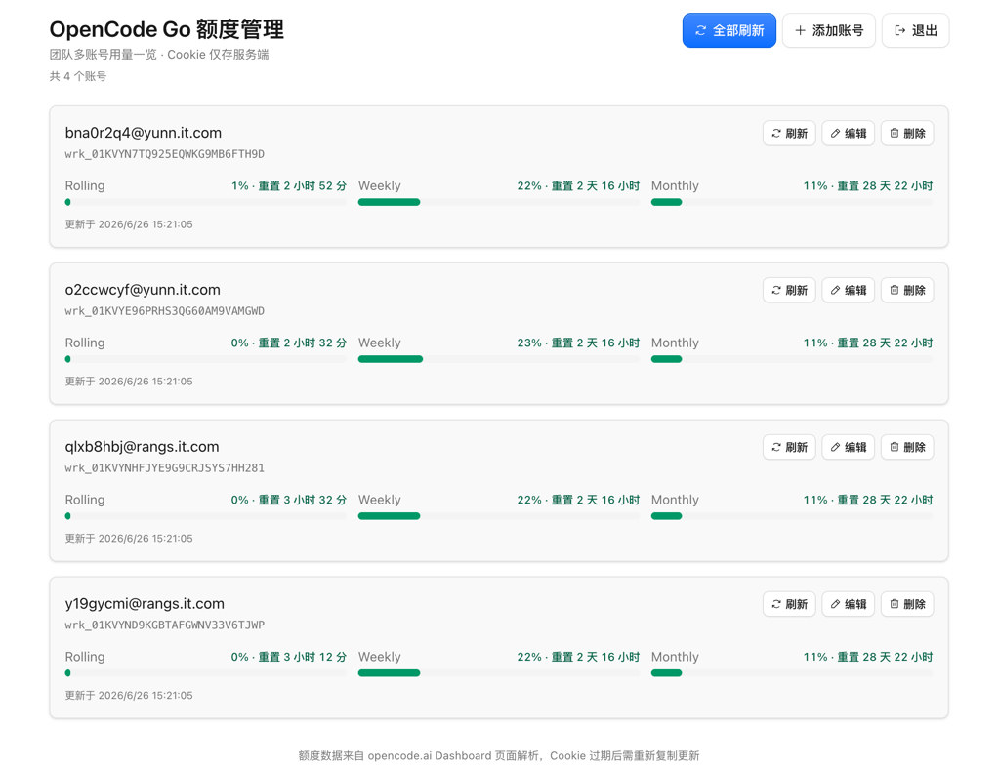

# OpenCode Go Dashboard

自托管的 OpenCode Go 额度管理面板，用于集中查看多个账号的 Rolling / Weekly / Monthly 用量。Auth Cookie 仅保存在服务端 Cloudflare D1，不会返回给浏览器。



## 功能

- 密码保护的管理后台
- 多账号增删改查
- 一键刷新单个或全部账号额度
- 用量接近上限时高亮提示
- 部署在 Cloudflare Workers，全球边缘节点访问

## 技术栈

- **前端**: React 19 + Vite + Tailwind CSS + [Cloudflare Kumo](https://github.com/cloudflare/kumo)
- **后端**: Cloudflare Workers
- **数据库**: Cloudflare D1 (SQLite)

## 前置要求

- [Node.js](https://nodejs.org/) 20+
- [Cloudflare 账号](https://dash.cloudflare.com/sign-up)
- [Wrangler CLI](https://developers.cloudflare.com/workers/wrangler/) v4+

## 快速开始

### 1. 克隆并安装依赖

```bash
git clone https://github.com/Ruinique/opencode-go-dashboard.git
cd opencode-go-dashboard
npm install
```

### 2. 登录 Cloudflare

```bash
npx wrangler login
```

### 3. 创建 D1 数据库

```bash
npx wrangler d1 create opencode-go-dashboard
```

命令会输出 `database_id`，将其填入 `wrangler.jsonc` 中 `d1_databases[0].database_id` 字段，替换默认的占位符 `00000000-0000-0000-0000-000000000000`。

### 4. 配置管理密码

本地开发时，复制示例文件并设置密码：

```bash
cp .dev.vars.example .dev.vars
```

编辑 `.dev.vars`：

```env
ADMIN_PASSWORD=your-strong-password-here
```

生产环境通过 Wrangler Secret 设置（不要提交到 Git）：

```bash
npx wrangler secret put ADMIN_PASSWORD
```

### 5. 执行数据库迁移

```bash
# 本地开发
npm run db:migrate:local

# 生产环境
npm run db:migrate:remote
```

### 6. 本地开发

```bash
npm run preview
```

默认在 `http://localhost:8787` 启动，同时运行 Worker API 和前端静态资源。

仅开发前端 UI（不经过 Worker）：

```bash
npm run dev
```

## 部署到 Cloudflare

### 标准部署（workers.dev 子域名）

确保已完成上述步骤 3–5，然后：

```bash
npm run deploy
```

部署成功后，Wrangler 会输出访问地址，形如 `https://opencode-go-dashboard.<your-subdomain>.workers.dev`。

### 绑定自定义域名（可选）

在 `wrangler.jsonc` 中取消注释 `routes` 配置，将 `dashboard.example.com` 替换为你的域名：

```jsonc
"routes": [
  {
    "pattern": "dashboard.example.com",
    "custom_domain": true
  }
]
```

域名需已在 Cloudflare 账号中，然后重新部署：

```bash
npm run deploy
```

## 使用说明

1. 打开部署后的地址，输入 `ADMIN_PASSWORD` 登录。
2. 点击「添加账号」，填写：
   - **显示名称**：便于识别的备注名
   - **Workspace ID**：格式为 `wrk_xxx`，可在 OpenCode 工作区 URL 中找到
   - **Auth Cookie**：从浏览器开发者工具中复制 `auth` Cookie 值（以 `Fe26.` 开头）
3. 点击「刷新」或「全部刷新」获取最新额度。
4. Cookie 过期后，编辑对应账号并粘贴新的 Cookie。

### 获取 Auth Cookie

1. 在浏览器中登录 [opencode.ai](https://opencode.ai)
2. 打开开发者工具 → Application（或 Storage）→ Cookies
3. 找到 `auth` Cookie，复制其值

## 项目结构

```
├── src/
│   ├── client/          # React 前端
│   └── worker/          # Cloudflare Worker API
├── migrations/          # D1 数据库迁移
├── wrangler.jsonc       # Cloudflare Workers 配置
├── .dev.vars.example    # 本地环境变量示例
└── index.html
```

## 环境变量

| 变量 | 说明 | 设置方式 |
|------|------|----------|
| `ADMIN_PASSWORD` | 管理后台登录密码 | `.dev.vars`（本地）/ `wrangler secret`（生产） |

## 安全提示

- **务必使用强密码**作为 `ADMIN_PASSWORD`
- Auth Cookie 具有账号访问权限，请妥善保管服务端环境
- 不要将 `.dev.vars` 提交到版本控制
- 建议仅在内网或受信任的团队成员间共享访问地址

## 许可证

[MIT](LICENSE)